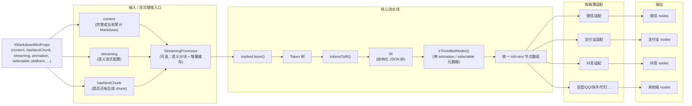
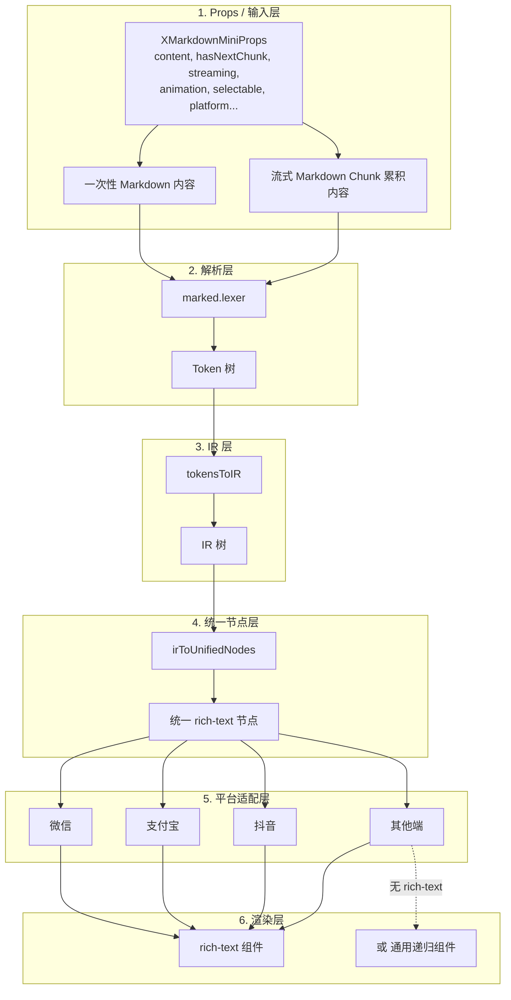
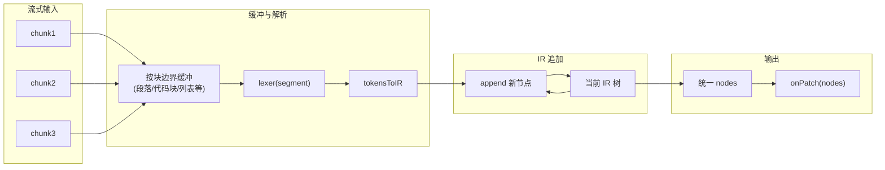
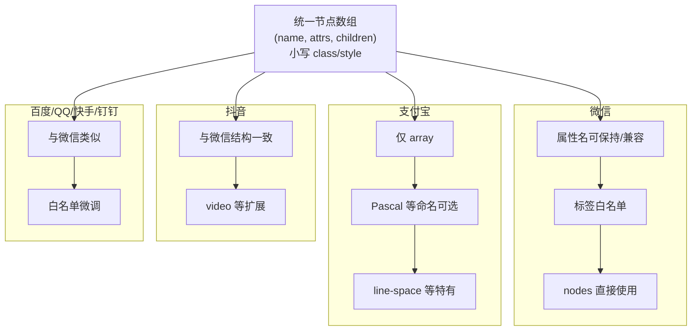
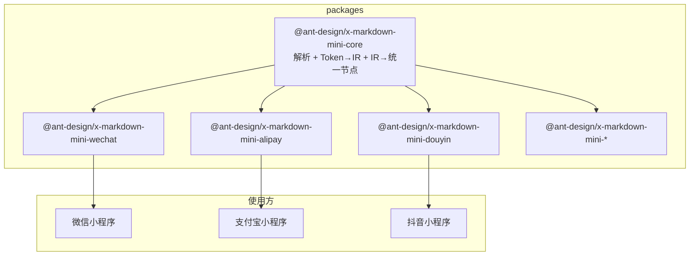
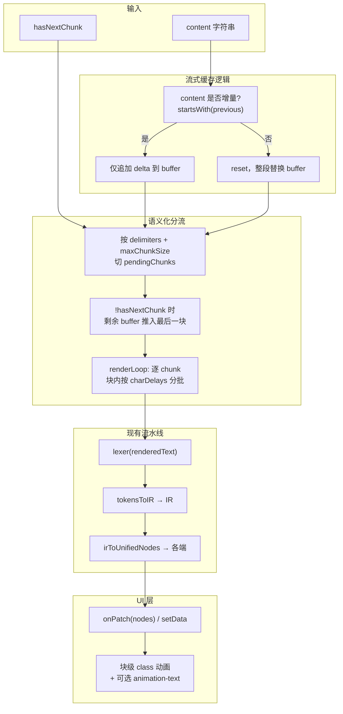

# x-markdown-mini 整体方案与流程图

## 一、方案摘要

- **目标**：多小程序场景下的高性能、强扩展、流式友好的 Markdown 渲染器（ant-design/x-markdown-mini）。
- **核心思路**：  
  - 解析用 **marked Lexer** 得到 token 树，转成**统一 IR（结构化 JSON 树）**；  
  - IR 只转成**一种**中间形态——**统一 rich-text 节点数组**；  
  - 各端**都有 rich-text**，全部走「统一节点 → 各端薄适配 → 该端 nodes」，不区分「用 HTML」与「手写整套转换」。

---

## 二、整体数据流（主流程图 + Props）



---

## 三、分层架构图



---

## 四、流式渲染路径（可选）



---

## 五、各端适配差异（薄适配在做什么）



---

## 六、模块与仓库结构建议



---

## 七、关键设计点汇总

| 环节 | 做法 |
|------|------|
| **解析** | 使用 marked.lexer()，不跑 HTML 渲染，得到 Token 树 |
| **IR** | tokensToIR() 产出统一 IR 树（如 `{ t, a?, c? }`），便于流式 append、TOC、扩展 |
| **统一节点** | irToUnifiedNodes() 只产一种「统一 rich-text 节点数组」，与微信/抖音结构对齐 |
| **各端** | 全部用「统一节点 → 薄适配 → 该端 nodes」，有 rich-text 的端都用 rich-text |
| **流式** | 按块边界缓冲 → 分段 lexer → tokensToIR → IR append → 统一 nodes → onPatch |
| **无 rich-text 端** | 用同一套「统一节点」驱动通用递归组件（view/text）渲染 |

---

## 八、流式增强能力（借鉴 markdown-x-mini）

在参考项目 **markdown-x-mini**（同目录下）中已有**语义化分流、动画、流式缓存**等流式相关实现，建议在 x-markdown-mini 中作为可选能力接入，与现有「IR + 统一节点」流水线兼容。

### 8.1 语义化分流（Semantic Chunking）

**作用**：不按固定字符数切块，而是按**语义断句**（标点）切块，再在块内按字符/批逐步输出，实现「打字机感」的流式展示。

**markdown-x-mini 实现要点**（`StreamingMarkdownProcessor`）：

- **状态**：`buffer`（未切完的原文）、`renderedText`（已输出给 UI 的文本）、`pendingChunks`（待渲染的语义块）、`previousMarkdown`（上一帧完整 content，用于增量判断）。
- **配置**（`SemanticConfig`）：
  - `delimiters`：语义分隔符正则，默认 `/[。？！……；：——，]/`。
  - `maxChunkSize`：单块最大字符数，超长句强制按长度切。
  - `chunkDelays`：块与块之间的延迟（如 `[300, 200, 100, 0]` ms）。
  - `charDelays`：块内字符/批的延迟（打字机速度）。
- **流程**：  
  `content` 更新 → 判断是否增量（`content.startsWith(previousMarkdown)`）→ 增量部分追加到 `buffer` → 用 `delimiters` + `maxChunkSize` 切出 `pendingChunks` → 若 `!hasNextChunk` 把剩余 `buffer` 也推入 → `renderLoop` 按 chunk 消费，块内再按 `charDelays` 分批 `onUpdate(renderedText)`。
- **与解析的关系**：每次 `onUpdate(text)` 时，用当前 `text` 做 **Markdown → HTML → AST**（或在我们方案里 **Markdown → lexer → IR → 统一节点**），再 `callback(ast)` / `onPatch(nodes)` 更新 UI。

**接入 x-markdown-mini 的建议**：

- 在 core 中提供可选模块 `StreamingProcessor`（或同名），输入为 `content` + `hasNextChunk`，输出为按语义分块后的「渐进式 full markdown 字符串」流，每步调用现有「lexer → tokensToIR → irToUnifiedNodes → 各端适配」流水线即可，无需改 IR 结构。
- `SemanticConfig` 可做成可选配置项（如 `streaming: { semantic: true | SemanticConfig }`），默认关闭。

---

### 8.2 动画（Animation）

**作用**：流式时新出现的「块」或「文本片段」带淡入/打字机动画，提升观感。

**markdown-x-mini 实现要点**：

- **块级动画**：在 AST 对应节点上挂 class（如 `markdownx__animation`），CSS 使用 `@keyframes` 做 opacity 0→1，时长可由 CSS 变量控制（如 `--markdownx-animation-duration`）。
- **文本级动画**：`animation-text` 组件接收整段 `text`，内部用 `chunkList` 维护「按流式追加的片段」：
  - 若 `text` 不以 `prevText` 开头则视为全新内容，`chunkList = [text]`；
  - 否则只把新增部分 `text.slice(prevText.length)` push 进 `chunkList`；
  - 模板里对 `chunkList` 每项一个 `<text class="animation-text-char">`，配合 CSS 的 `typewriterFadeIn` 实现逐段淡入。
- **开关**：`animation`、`animationChunkSize` 由上层传入，richtext 在「纯文本」节点用 `animation-text`，其余用普通 text/view 并可选加块级 animation class；代码块内通常关闭动画（`animation="{{false}}"`）避免过于花哨。

**接入 x-markdown-mini 的建议**：

- **统一节点层**：在节点上增加可选元数据，如 `animate: 'block' | 'text' | false`，由「IR → 统一节点」时根据配置写入；各端适配层在输出 nodes 时保留 class（如 `md-animation`），或输出到自定义组件（见下）。
- **渲染层**：  
  - 使用 **rich-text** 的端：仅能通过 class + 全局样式做块级淡入；若要做「逐段文字动画」，需该端支持在 rich-text 内嵌自定义组件，或接受「仅块级动画」。  
  - 使用 **通用递归组件** 的端：可完整实现「块级 class 动画 + 文本级 animation-text 组件」，与 markdown-x-mini 行为一致。
- 配置项建议：`animation?: boolean`，`animationChunkSize?: number`（可选），以及可选的 `animationClass` / 时长等交给主题或样式层。

---

### 8.3 流式缓存（hasNextChunk + 增量更新）

**作用**：在「还有后续 chunk」时避免整文重算、重复渲染；只做增量追加，并在流结束前不把「未结束的尾部」当作完整块提交。

**markdown-x-mini 实现要点**：

- **入口**：组件 `deriveDataFromProps` 里比较 `content`、`hasNextChunk`；若变化则调用 `parseMarkdown(newContent, newHasNextChunk)`。
- **Parser**：  
  - `hasNextChunk === true` 或 `isProcessing === true` 时走 **流式路径**（`parseStream`）；否则走一次性 `parseFull`。  
  - 流式路径里：`StreamingMarkdownProcessor.process({ content, hasNextChunk, onUpdate, onComplete })`；仅在 `!hasNextChunk && renderedText === fullContent` 时调用 `onComplete` 并置 `isProcessing = false`。
- **StreamingProcessor 内**：  
  - `handleContentUpdate(content)`：若 `content.startsWith(previousMarkdown)` 则只把多出来的部分追加到 `buffer`，否则 `reset` 后整段替换。  
  - `splitIntoChunks(hasNextChunk)`：若 `remaining && !hasNextChunk` 才把剩余 `buffer` 当作最后一块 push，避免流未结束时把半句话当完整块输出。  
- 效果：同一轮流式推送中，只解析「当前已输出的字符串」并更新 UI，不重复解析历史前缀；流结束后一次用 `fullContent` 做最终解析并触发完成回调。

**接入 x-markdown-mini 的建议**：

- **API**：对外暴露 `hasNextChunk`（或等价的 `isStreaming`）与 `content`；当 `hasNextChunk === true` 时，内部采用「增量 content + 流式处理器」，并在流结束时再触发 `onRenderComplete`。
- **缓存语义**：不额外做「解析结果缓存」也可；关键是在流式分支里**只根据当前 content 增量更新**（语义化处理器内部已用 `previousMarkdown` 做增量），避免全量重算。若未来要做解析缓存（如相同 content 前缀复用 AST），可在「lexer → IR」层加一层前缀缓存，与 markdown-x-mini 的「只更新 renderedText 再重新 parse」的语义等价。
- 在架构图中可把「流式缓存」体现为：`hasNextChunk` 控制是否走流式分支，流式分支内 `content` 增量更新 + 仅结束时提交完整内容。

---

### 8.4 流式增强整体流程图



---

### 8.5 设计点汇总（流式增强）

| 能力 | 做法 |
|------|------|
| **语义化分流** | 可选 `StreamingProcessor`：delimiters + maxChunkSize 切块，chunkDelays/charDelays 控制节奏；每步输出「当前完整 markdown 字符串」交给现有解析→IR→节点流水线。 |
| **动画** | 块级：统一节点带 animation class，CSS 淡入。文本级：通用递归组件端用「animation-text」式组件，按 chunkList 逐段淡入；rich-text 端仅块级或依赖端能力。 |
| **流式缓存** | `hasNextChunk` 控制走流式分支；流式内用 `previousMarkdown` 做 content 增量，只把 delta 追加到 buffer；`!hasNextChunk` 时再把尾部推出并触发 onComplete。 |

以上内容可作为 x-markdown-mini 在实现流式时的参考；与现有「IR + 统一节点 + 各端薄适配」方案无冲突，可按需分阶段接入（先流式缓存 + 语义化分流，再动画）。

---

## 九、对外 Props 设计（精简版）

结合前面的讨论，当前阶段对外组件 Props 设计遵循：

- **不暴露渲染模式开关**：暂时统一用 rich-text 路径，无 `renderMode`。
- **保留 `selectable`**：跨端尽量映射文本可选能力，默认可配置为 `true`。
- **暂不暴露主题 token / 节点级事件**：`themeTokens`、`onElementTap`、`onElementAppear` 等先不提供，等有明确主题/埋点需求再通过扩展接入。

一个示意性的 Props 形状如下（供实现时参考）：

```ts
export interface SemanticStreamingConfig {
  delimiters?: RegExp;
  maxChunkSize?: number;
  chunkDelays?: number[];
  charDelays?: number[];
}

export type Platform =
  | 'wechat'
  | 'alipay'
  | 'douyin'
  | 'baidu'
  | 'qq'
  | 'kuaishou'
  | 'dingtalk'
  | 'jd'
  | 'other';

export interface XMarkdownMiniProps {
  /** Markdown 文本（全量或当前累计流式内容） */
  content: string;

  /** 目标平台，可选，不填则由各端包自行决定 */
  platform?: Platform;

  /** 是否在流式中，有后续 chunk；true 时启用增量缓存语义 */
  hasNextChunk?: boolean;

  /** 语义流式渲染配置 */
  streaming?: false | true | SemanticStreamingConfig;

  /** 动画开关 / 配置（块级 + 可选文本级），可以先只实现 boolean 版本 */
  animation?: boolean;

  /** 文本是否可选择（推荐默认 true，各端适配尽量映射） */
  selectable?: boolean;

  /** Markdown 解析选项（例如 gfm、breaks、自定义 renderer 等） */
  options?: Record<string, any>;

  /** 渲染生命周期 */
  onRenderStart?: () => void;
  onRenderProgress?: (payload: { markdown: string }) => void;
  onRenderComplete?: () => void;
}
```

后续如果需要：

- 支持多主题 / Design Token 对齐时，再在此基础上增加专门的 `theme` / `tokens` 设计；
- 需要更细粒度埋点时，再考虑通过插件机制增加节点级事件回调，而不是一次性塞进基础 Props。
